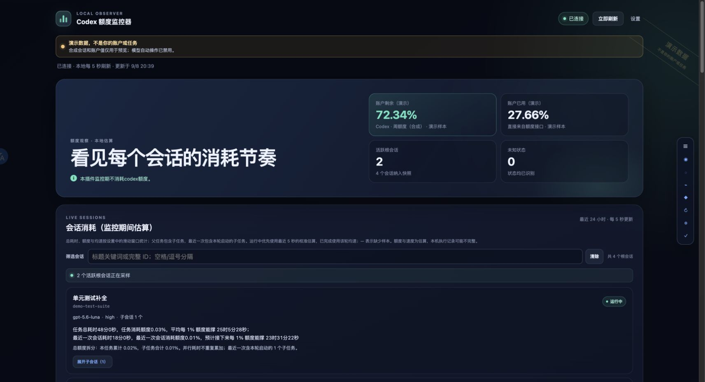
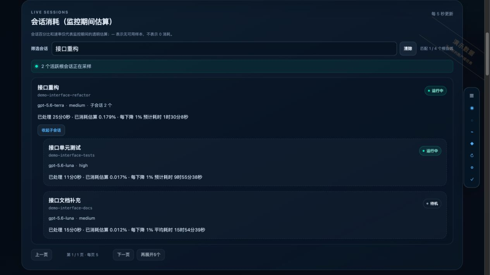
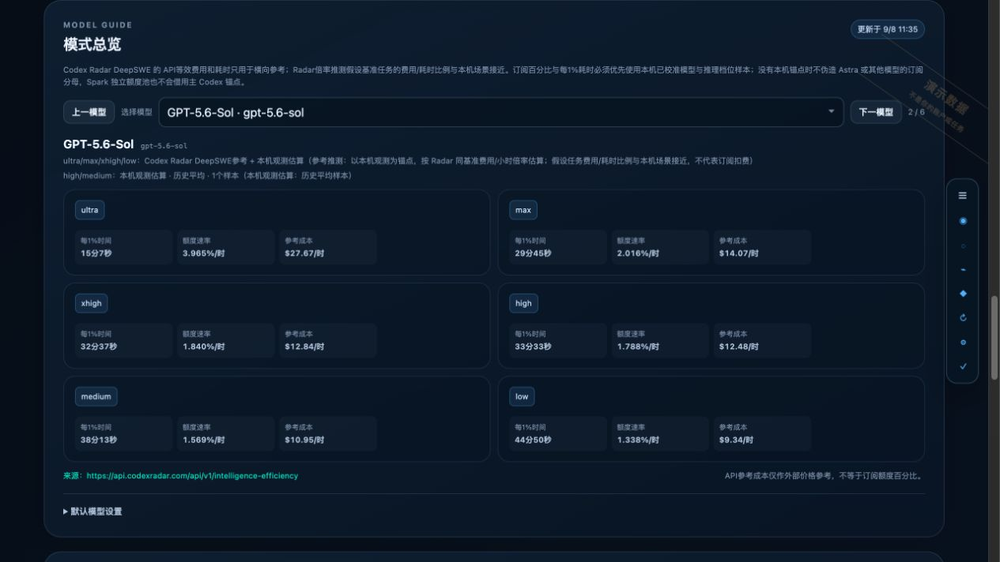
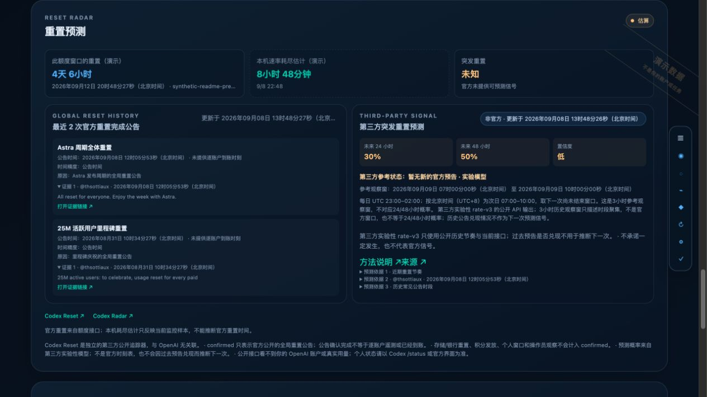

# Codex Quota Monitor

Codex Quota Monitor is a local v0.2.0 beta plugin for observing Codex account windows, discovering local sessions, and presenting transparent estimates of per-session subscription usage. It does not present an estimate as an official itemized bill.

[中文 README](./README.md) · [Diagnosis guide](./docs/diagnosis.md)

## Quick start

Prerequisites: a ChatGPT/Codex desktop build that supports local plugins, Node.js `>=22.13.0`, and a Codex CLI compatible with that desktop build.

To have Codex install and start it for you, send Codex this exact prompt:

```text
Please install and start this plugin, then provide a clickable URL in the chat when it is ready: https://github.com/tristan-me/codex-quota-monitor
```

After installation, open a new local Codex conversation, type `@`, choose **Codex Quota Monitor** from the suggestions, and send: `打开 Codex 额度监控器。`

Here is the complete Markdown mention text to send:

```markdown
[@Codex Quota Monitor](plugin://codex-quota-monitor@codex-quota-monitor) 打开 Codex 额度监控器。
```

In the actual composer, type `@` and select the plugin. Pasting the Markdown alone is not guaranteed to create a valid mention.

## Screenshots

Account, session, and consumption values in these screenshots are synthetic examples. Reset announcements and third-party probabilities are public reference data captured at screenshot time, not current forecasts.



| Sessions and child threads | Model tiers |
| --- | --- |
| [](docs/images/sessions.jpg) | [](docs/images/models.jpg) |



## What this beta does

- Reads local SQLite metadata in read-only mode to discover sessions through both the new paginated path and the legacy path. It does not write to the Codex database.
- Refreshes the local cache every 5 seconds by default and polls account quota every 30 seconds by default. Both intervals are configurable in the panel.
- Shows official account remaining/used percentages and reset time without requiring a manually selected plan multiplier. When the service only returns Pro, the monitor does not guess 5x versus 20x.
- Tracks samples after monitoring starts and displays consumption, observed speed, reset countdowns, and a linear exhaustion estimate based on the observed trend.
- Probes `threadUsage` availability. This release allocates account-window changes by local token deltas; credit-based calibration remains future work. The tested account returns `threadUsage=null`.
- Shows this notice every time the panel opens, with a “Do not remind me again” checkbox and a confirmation control:

  > Important: per-session percentages and speeds are transparent estimates, not official exact itemization or a guarantee about future usage.

Three decimal places are a display format only. They do not imply that the underlying data or an official account breakdown has three-decimal accuracy. Insufficient samples remain marked as warming up instead of being shown as a fabricated zero rate.

## Sessions and model overview

Root sessions and child sessions keep their first-observed order. New entries append at the end; status, usage, and update-time changes do not reorder them. The order is saved with the local monitoring state and survives service restarts.

The right-edge table of contents expands on hover or keyboard focus. Search sessions by title keywords or exact IDs. The list starts with five root sessions per page, supports expanding five more at a time, and keeps child sessions collapsible. Search and expansion survive refreshes. Session totals preserve observed allocations across quota resets; unobserved history cannot be recovered. Completed tasks use measured average rates when timing evidence exists.

The model overview shows one model per page, with a selector and previous/next controls. Desktop cards use three rows: `ultra / max`, `xhigh / high`, and `medium / low`. Shared source notes appear above the cards. Local observations take priority; dated Codex Radar DeepSWE cost/hour ratios are only used with a comparable local calibration sample. API costs do not equal subscription percentages, and Spark's separate quota pool does not borrow calibration from the main Codex pool.

## Cost and accuracy boundaries

The UI reads the local cache every 5 seconds by default, about 720 local reads per hour. While the service is running, account quota is polled every 30 seconds by default, about 120 reads per hour. Model-list and thread-usage capability probes run at most hourly after success, with one-minute minimum retry after failure. Counters measure RPC calls; authentication and retries may cause additional HTTP requests. Refreshing the panel makes zero model calls, but local HTTP, SQLite, CPU, and network metadata reads still have a cost. The underlying Codex session that uses the tool continues to consume tokens and subscription quota normally.

The public Codex Reset timeline and forecast endpoints are each fetched every 15 minutes, about eight public GET requests per hour. Pausing background reads also pauses these requests. They contain no local account or session data, and a reference-source failure does not interrupt official quota reads.

Account windows are account-level data. Per-session numbers are estimates covering samples after monitoring started, not lifetime session history. When `threadUsage=null`, the monitor can only allocate account changes by local token-delta proportions. The true weights of different models are unknown, and activity from other devices, background work, or undiscovered threads can contaminate the account window, so this mode is low confidence. If the account window changes without a matching local token delta, the difference remains in `unattributed` instead of being forced onto a session.

Personal reset timing follows the account window's reported countdown. Exhaustion timing is an estimate from observed speed. The two latest official completion announcements are shown separately with post timestamps and evidence; announcement time is not per-account arrival telemetry. Surprise-reset probabilities come from an experimental third-party forecast. When no future official window exists, a clearly labeled observation window is calculated from the published historical time-of-day rule; it is not a promised reset time or the interval associated with the 24/48-hour probabilities.

## Boundary with the native Codex UI

There is currently no official mount point that guarantees a custom popup every time the native Codex window opens, and no official interface for embedding “processed for xx minutes, live rate, and consumed quota” into native Codex text. Therefore v0.2.0 beta uses an independent/compact panel for the notice and metrics; it does not claim to have completed those native UI requirements.

Mode switching is opt-in in the UI. When enabled, it writes only the default `model` and `model_reasoning_effort` for the next new task. It does not take over a running task and does not claim to be globally optimal or the official best value choice. External references: [Codex Radar](https://codexradar.com/#model-ratings) and [Codex Reset](https://codex-reset.com/zh/).

The project code is MIT-licensed. Rights to third-party reference data, public endpoint responses, and quoted post text remain with their respective sources. A public endpoint is not automatically an open-data license; see the [third-party sources and licensing note](./THIRD_PARTY_NOTICES.md).

The plugin does not intercept composer input or submit turns on the user's behalf, and it does not promise to fix `failed to submit turn input: EmptyInput`. Use the [diagnosis guide](./docs/diagnosis.md) to separate host Codex, CLI/App Server, and local-panel failures.

## Install and run locally

Requirements: a ChatGPT/Codex desktop build with local-plugin support, Node.js `>=22.13.0`, and a Codex CLI compatible with the desktop build. The runtime has zero npm dependencies. `node:sqlite` is still experimental on Node 22.13, and is supported by this project.

### Recommended: start from an installed ChatGPT/Codex desktop app

In a new local conversation, use the quick-start prompt above, or run these commands in a compatible Codex CLI with working GitHub access:

```bash
codex plugin marketplace add https://github.com/tristan-me/codex-quota-monitor
codex plugin add codex-quota-monitor@codex-quota-monitor
```

After installation, open “Settings → Plugins” in the desktop app and confirm that **Codex Quota Monitor** is enabled. Then start a new local conversation, type `@`, select the plugin, and send `打开 Codex 额度监控器。`; the plugin starts the local service and returns the current valid URL in the chat.

Identify the plugin by these manifest fields; this table is not a screenshot of the native settings page:

| Field | Value |
| --- | --- |
| Display name | Codex Quota Monitor |
| Short description | 本地会话额度估算与实时速率 |
| Developer | Quanli Li |
| Plugin / marketplace ID | `codex-quota-monitor@codex-quota-monitor` |

The official general guide is [Plugins in ChatGPT](https://learn.chatgpt.com/docs/plugins). Desktop menu labels may vary by build.

From the repository root, start the independent panel:

```bash
node plugins/codex-quota-monitor/server/launcher.mjs
```

In a second terminal, add the local marketplace to Codex and install the plugin:

```bash
codex plugin marketplace add https://github.com/tristan-me/codex-quota-monitor
codex plugin add codex-quota-monitor@codex-quota-monitor
```

### Optional: local registration and an independent launcher after cloning

If you have downloaded or cloned the [GitHub repository](https://github.com/tristan-me/codex-quota-monitor), register the local marketplace:

```bash
git clone https://github.com/tristan-me/codex-quota-monitor
cd codex-quota-monitor
codex plugin marketplace add "$PWD"
codex plugin add codex-quota-monitor@codex-quota-monitor
```

To open the independent local panel directly, double-click `Open-Monitor.command` on macOS or run:

```bash
node plugins/codex-quota-monitor/server/launcher.mjs
```

Prefer the Codex CLI that is compatible with the desktop build. If PATH resolves to an older CLI, its App Server capabilities may not match the desktop configuration. Check `codex --version` before treating a compatibility error as a quota-data error.

After startup, open Codex Quota Monitor in Codex. The panel uses a local `127.0.0.1` HTTP service with a random access token; it is not a public website. Do not post a token-bearing local URL in an issue, chat, or screenshot.

Stop the background service with `node plugins/codex-quota-monitor/scripts/stop.mjs`. Turning off automation stops future changes; the restore button restores the original defaults only if no external edit conflicts.

Live and demo state, credentials, and endpoints are isolated. Demo pages are explicitly marked as synthetic. Offline pages withdraw live values and explain how to reopen the launcher. Clean restarts reuse the saved loopback endpoint; an occupied port is reported without terminating another application.

### Bookmark and local-URL FAQ

- The panel URL contains a complete `#token` and works only on the same computer while the corresponding monitor service is running. Treat it as a local access credential and do not share it.
- Closing the web page does not stop the background service, so the same bookmark can be reopened while the service is still running.
- After a reboot or service stop, the old bookmark does not start anything. Run `Open-Monitor.command` again, or open the plugin from a new local conversation so the plugin can provide the current valid URL.
- An HTTP bookmark does not launch the desktop app or start a stopped background service automatically.

## Privacy

The plugin does not collect credentials, prompts, answers, or telemetry, and does not upload data to a third-party service. It reads local Codex metadata and local SQLite and stores derived state locally. Remove access tokens, account quota values, private session IDs, working directories, and conversation text before filing an issue.

The monitor does not read authentication files. The legacy adapter reads a bounded JSONL tail and extracts only lifecycle and token metadata; it does not retain or upload conversation text. Titles can originate from the first prompt line and remain private local data.

## Development and validation

The project intentionally has zero npm dependencies. CI covers Node 22.13 and Node 24:

```bash
cd plugins/codex-quota-monitor
node --test tests/*.test.mjs
```

If the local Node 22.13 build requires the experimental SQLite flag, run:

```bash
node --experimental-sqlite --test tests/*.test.mjs
```
