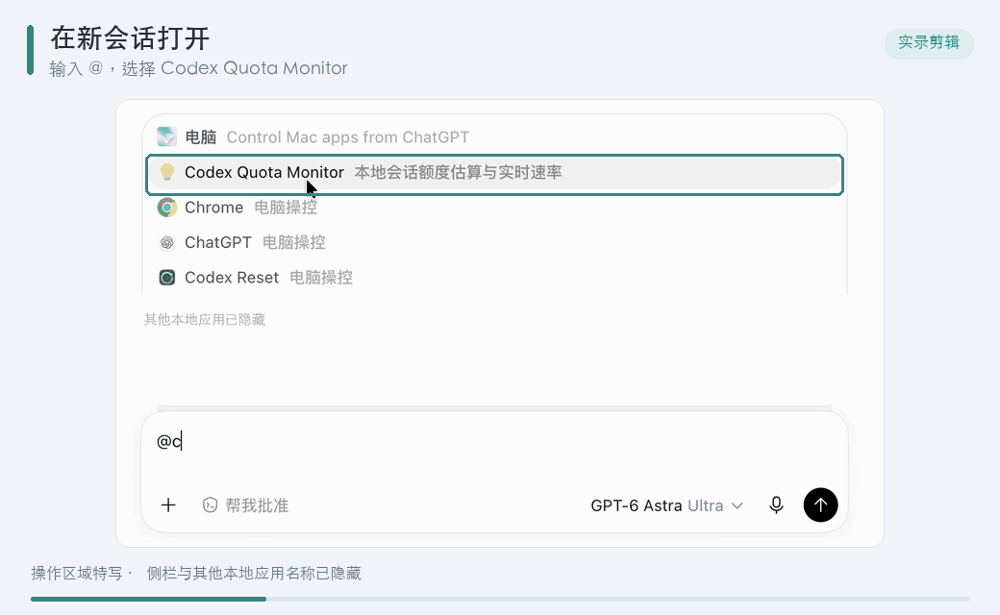
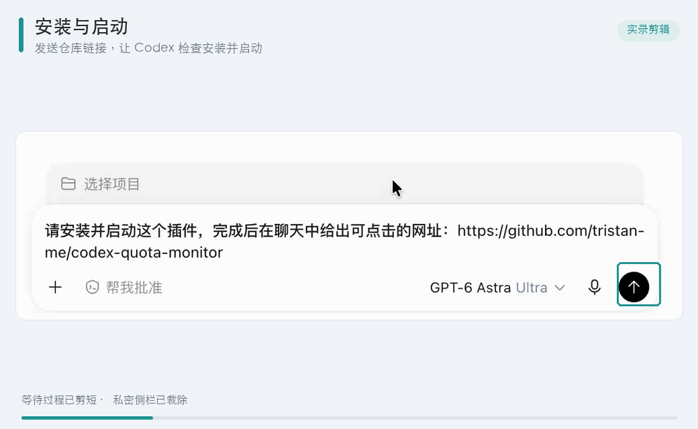
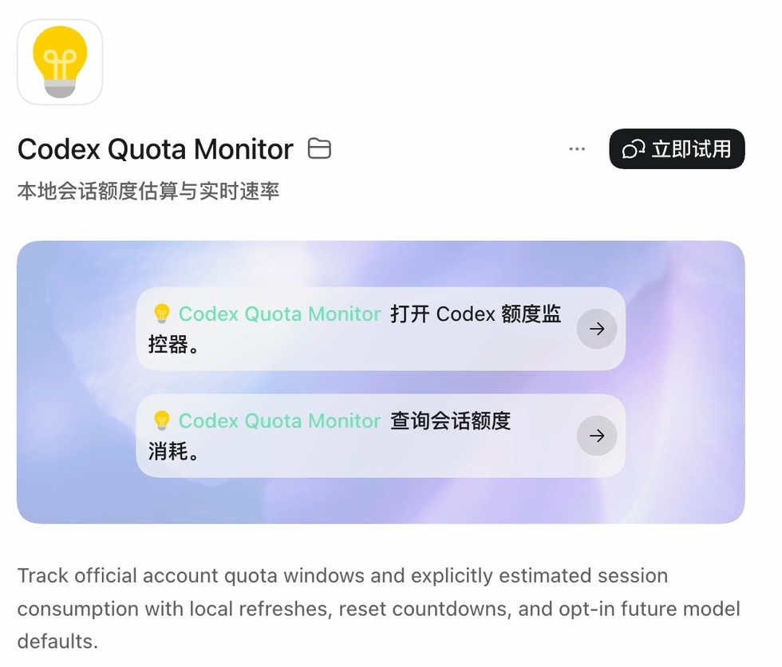
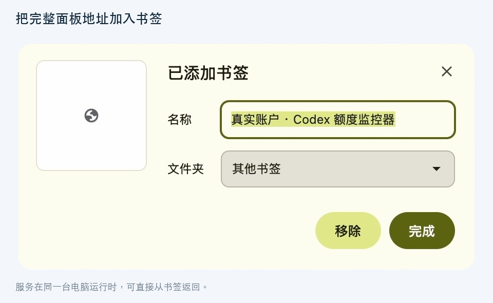

# Codex Quota Monitor

Codex Quota Monitor 是一个本地运行的 v0.2.0 beta 插件，用来观察 Codex 账户窗口、发现本机会话，并给出每会话订阅额度消耗的透明估算。它不会把估算结果包装成官方精确拆账。

[English README](./README.en.md) · [诊断指南](./docs/diagnosis.md)

## 快速启动

前提：使用支持本地插件的 ChatGPT/Codex 桌面版本，并安装 Node.js `>=22.13.0` 与兼容的 Codex CLI。

如果希望让 Codex 代为安装并启动，复制下面这句话发送给 Codex：

```text
请安装并启动这个插件，完成后在聊天中给出可点击的网址：https://github.com/tristan-me/codex-quota-monitor
```

安装完成后，在一个新的本地 Codex 会话中输入“@”，从候选列表选择 **Codex Quota Monitor**，然后发送：`打开 Codex 额度监控器。`



下面是用户要发送的完整 Markdown mention 文本：

```markdown
[@Codex Quota Monitor](plugin://codex-quota-monitor@codex-quota-monitor) 打开 Codex 额度监控器。
```

实际使用时请在输入框键入 `@` 并选择插件；直接粘贴这段 Markdown 不保证会被桌面端解析成有效 mention。

## 界面预览

以下截图中的账户、会话和消耗速率均为合成示例；重置公告与第三方预测是截图时的公开参考数据，不代表当前预测。


| 会话检索与子会话 | 模型档位总览 |
| --- | --- |
| [](docs/images/sessions.jpg) | [](docs/images/models.jpg) |


## 当前版本能做什么

- 通过本机 SQLite 元数据只读发现会话，兼容新的 paginated 路径和 legacy 路径；不会写入 Codex 数据库。
- 主面板显示当前账户的官方剩余/已用百分比、采样时间和北京时间重置时间；无需填写套餐倍率。接口只返回 Pro 时，不推断它是 5x 还是 20x。
- 默认每 5 秒刷新本地缓存，默认每 30 秒读取一次账户额度。两个频率都可以在面板中调整。
- 默认统计窗口为 24 小时，可在设置中改为 1–168 小时；这是滑动统计窗口，调整窗口不会删除 Codex 原始记录，扩大窗口也不能恢复已经清理的观测。
- 在监控开始之后记录会话样本，显示消耗百分比、观察速度、重置倒计时和基于线性趋势的耗尽预估。
- 检查账户是否返回 `threadUsage`；本版本以本机 token 增量比例分摊账户窗口变化，逐任务 credits 校准尚待后续版本实现。当前已验证账号返回 `threadUsage=null`。
- 面板每次打开都会显示以下说明，并提供“不再提醒”复选框和确认按钮：

  > 需要说明：每会话百分比和速度仍是透明标注的估算值，而不是官方提供的精确拆账或未来保证。

百分比和小数统一显示两位；内部计算保留更高精度。显示精度不代表底层数据或官方拆账具有两位小数的精度。样本不足时会显示 `—`，不会把缺少证据的速度显示成零。

## 查看会话与模型

右侧目录在鼠标移入或键盘聚焦时展开，点击可滚动到对应区域。会话列表支持标题关键词和完整 ID 搜索，多个查询用空格或逗号分隔；默认每页 5 个，也可每次多展开 5 个。搜索、分页和子会话展开状态会在自动刷新时保留。

每个任务分两行显示累计与最近一轮：

```text
任务总耗时xx，任务消耗额度xx%，平均每 1% 额度能撑 xx；
最近一次会话耗时xx，最近一次会话消耗额度xx%，预计接下来每 1% 额度能撑 xx
```

默认 24 小时滑动窗口内的执行记录参与总耗时、额度估算和平均速度计算。窗口可自定义为 1–168 小时；扩大窗口不会恢复已经清理的观测，也不会删除 Codex 原始记录。父任务总耗时包含已发现子任务，并发区间只计一次；耗时来自本机保留的执行记录，可能不完整。

“最近一次会话”指该任务自身最近一轮执行，子任务各自单列。已完成任务使用该轮的执行时间和额度记录计算预测；正在执行的任务优先使用最近 5 秒校准的 token 估算，不代表官方在 5 秒内精确扣费，缺少校准时回退本轮均速。额度与平均速度只覆盖监控窗口；旧数据不能可靠回填，缺少样本用 `—` 表示。

“模式总览”包含 Codex Radar DeepSWE 同基准费用与耗时的带日期参考快照。优先展示本机同模型档位的近期估算，缺少本机数据时，只有存在可比本机样本才用参考成本/小时倍率推算。API 等效美元成本不等于订阅百分比；Spark 的独立额度池不会从主 Codex 窗口推算。参考数据不会每 5 秒请求网站。

每页展示一种模型，可用下拉框或上一/下一模型切换。桌面视图按 `ultra / max`、`xhigh / high`、`medium / low` 三行两列排列；同来源的档位说明合并显示在卡片上方。

## 统计窗口与准确性边界

界面每 5 秒读取一次本地缓存，默认约 720 次/小时；服务运行时账户额度默认每 30 秒读取一次，约 120 次/小时。模型列表和逐任务能力探测各每小时一次；失败后最短一分钟重试。刷新只读取本地缓存和统计数据，不发起模型调用；正在执行的 Codex 任务仍按正常方式消耗 token 和订阅额度。本插件监控期不消耗 Codex 额度，指监控不发起模型调用，不表示实际任务免费。

Codex Reset 的公开时间线与预测接口每 15 分钟各读取一次，约 8 次公开 GET/小时；暂停后台读取时也会暂停这两项请求。请求不包含本地账户或会话数据，失败不会影响官方额度读取。

账户窗口是账户级数据。每会话数据属于估算，并且只覆盖选定统计窗口内的样本，不代表窗口外的会话历史。当前 `threadUsage=null` 时，插件只能按照本机 token 增量比例分摊账户变化；不同模型的真实权重未知，其他设备、后台任务或未被发现的线程也可能污染账户窗口，所以这类结果会标为低置信度。账户窗口发生变化而本机没有可匹配 token 增量时，差额会留在 `unattributed`，不会强行分配给某个会话。服务离线期间的账户变化也归入未归因项；同一窗口内重启保留已记录值。

个人窗口的重置倒计时直接来自账户接口；耗尽时间是根据观测速度做的估算。全局重置记录和突发预测单独展示：明确标注公告时间、证据链接、第三方概率及数据更新时间。没有未来官方窗口时，参考观察窗仅按历史时段规则生成，不承诺会在该时段重置。

## 与原生 Codex UI 的边界

已定向核验桌面版 Codex 0.153.4 的插件挂载点、生命周期 Hook 与 App Server schema。Hook 面向 session/turn，没有原生窗口启动事件；`turn/steer` 不接受 model 覆盖，默认 model 也不热加载到已运行的任务。详见[官方 App Server 文档](https://developers.openai.com/codex/app-server)和[Hooks 文档](https://developers.openai.com/codex/hooks)。本插件不通过修改 Electron 包、注入页面或中断任务实现这些功能。

当前没有官方挂载接口可以保证在每次打开原生 Codex 窗口时弹出自定义弹窗，也没有官方接口可以把“已处理 xx 分钟 xx 秒、实时速率、已消耗额度”嵌入原生 Codex 文本。因此 v0.2.0 beta 提供独立/compact 面板来承载免责声明和指标，不宣称已经完成这些原生 UI 要求。

自动切换模式是可选的，必须由用户在界面中明确开启。启用后只写入默认 `model` 和 `model_reasoning_effort`，作用于下一次新任务；不会接管已经运行的任务，也不会宣称它一定是性价比最高或官方最优方案。外部参考来源：[Codex Radar](https://codexradar.com/#model-ratings)、[Codex Reset](https://codex-reset.com/zh/)。

项目代码采用 MIT；第三方参考数据、公开接口返回和原帖文字的权利归各来源权利人所有。公开接口不等于开放数据许可，详见[第三方来源与许可说明](./THIRD_PARTY_NOTICES.md)。

插件不拦截 composer 输入、不代替用户提交 turn，也不承诺修复 `failed to submit turn input: EmptyInput`。遇到该错误请先按[诊断指南](./docs/diagnosis.md)区分宿主 Codex、CLI/App Server 和本地面板的问题。

## 安装与本地运行

要求：支持本地插件的 ChatGPT/Codex 桌面版本、Node.js `>=22.13.0`，以及与桌面版本兼容的 Codex CLI。运行时不需要 npm 依赖；Node 22.13 的 `node:sqlite` 仍处于实验状态，但在本项目中受支持。

### 推荐：从已安装的 ChatGPT/Codex 桌面端开始

在新本地会话中使用上面的快速启动提示，或者在可访问 GitHub 的终端执行：

```bash
codex plugin marketplace add https://github.com/tristan-me/codex-quota-monitor
codex plugin add codex-quota-monitor@codex-quota-monitor
```

安装完成后，在桌面端打开“设置 → 插件”，确认 **Codex Quota Monitor** 已启用。然后新建本地会话，输入 `@` 并选择插件，再发送 `打开 Codex 额度监控器。`；插件会启动本机服务，并在聊天中返回可点击的当前有效 URL。

安装动图展示的是已安装后的检查与启动流程，不是全新的安装过程：



可以用下列清单字段识别插件；这张表来自插件配置，不是原生设置页截图：

| 字段 | 内容 |
| --- | --- |
| 显示名称 | Codex Quota Monitor |
| 简介 | 本地会话额度估算与实时速率 |
| 开发者 | Quanli Li |
| 插件 / 来源标识 | `codex-quota-monitor@codex-quota-monitor` |



官方通用插件安装说明见 [Plugins in ChatGPT](https://learn.chatgpt.com/docs/plugins)；桌面端菜单名称可能随版本变化。

### 可选：已 clone 后的本地注册与独立入口

如果你已经下载或克隆了 [GitHub 仓库](https://github.com/tristan-me/codex-quota-monitor)，可以从本地目录注册 marketplace：

```bash
git clone https://github.com/tristan-me/codex-quota-monitor
cd codex-quota-monitor
codex plugin marketplace add "$PWD"
codex plugin add codex-quota-monitor@codex-quota-monitor
```

需要单独打开本地面板时，macOS 可以双击仓库根目录的 `Open-Monitor.command`，或者运行：

```bash
node plugins/codex-quota-monitor/server/launcher.mjs
```

优先使用与桌面版兼容的内置 Codex CLI。若系统 PATH 中存在更旧的 CLI，插件的 App Server 能力可能与桌面版配置不匹配；请先检查 `codex --version`，不要把版本差异当成额度数据问题。

启动后在 Codex 中打开 Codex Quota Monitor。面板使用本机 `127.0.0.1` HTTP 服务和随机访问 token，不是公开站点；不要公开分享带 token 的本地地址。正常重启会复用已保存的端口和 token；若端口被其他程序占用，会报错而不会关闭那个程序。

请通过启动器打开你的额度监控面板。`--demo` 是开发测试模式，使用独立 `demo/` 目录、独立 token，并醒目标明合成数据。演示地址不能代表你的账户。连接中断时页面撤下实时数据并提示重新打开启动器。

关闭接管仅停止后续自动修改；推荐区的“恢复接管前的默认模型”可以恢复。若你已在别处手动修改模型，恢复操作会拒绝覆盖。配置修改使用版本校验，测试在独立临时 CODEX_HOME 中完成。

停止后台服务：

```bash
node plugins/codex-quota-monitor/scripts/stop.mjs
```

本地数据默认位于 `~/.local/share/codex-quota-monitor-v2`。可用 `CODEX_QUOTA_MONITOR_DATA_DIR` 覆盖；用 `CODEX_QUOTA_MONITOR_CODEX_BIN` 指定与桌面兼容的 Codex 可执行文件。

### 书签与本地 URL FAQ

- 面板 URL 含有完整的 `#token`，只在同一台电脑、对应监控服务仍运行时有效；请把它当作本地访问凭据，不要公开分享。
- 关闭网页不会停止后台服务，因此服务仍运行时可以再次打开同一书签。
- 电脑重启或服务停止后，原书签不会自启动；请再次运行 `Open-Monitor.command`，或从新的本地会话打开插件，让插件提供当前有效 URL。
- HTTP 书签不会自动启动桌面应用，也不会自动拉起已停止的后台服务。



## 隐私

插件不读取认证文件，也不保存或上传 prompt、回答内容或遥测。它读取 SQLite 中的任务名称、模型、时间、状态、token 计数；legacy 回退会读取有限长度的 JSONL 尾部，只提取生命周期及 token 元数据，忽略对话内容。任务标题本身可能源自请求首行，因此仍属于本地私有信息。派生状态仅保存在本机。提交问题时请删除访问 token、账号额度、私人会话 ID、工作目录和对话内容。

## 开发与验证

项目刻意保持零 npm 依赖。测试矩阵覆盖 Node 22.13 和 Node 24：

```bash
cd plugins/codex-quota-monitor
node --test tests/*.test.mjs
```

Node 22.13 运行 SQLite 测试时，如本机要求显式启用实验 API，可使用：

```bash
node --experimental-sqlite --test tests/*.test.mjs
```

欢迎通过 GitHub issue 提交经脱敏的诊断信息、可重现 fixture、文档改进和跨平台测试。
